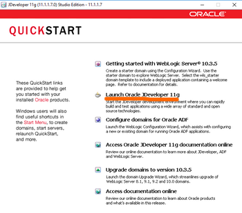
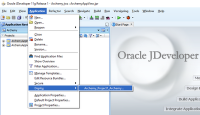
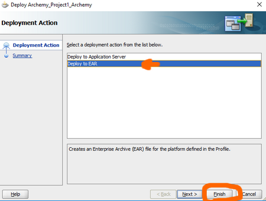
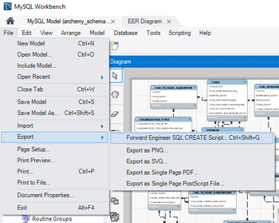
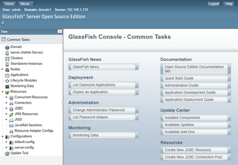
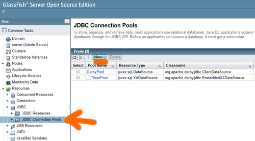
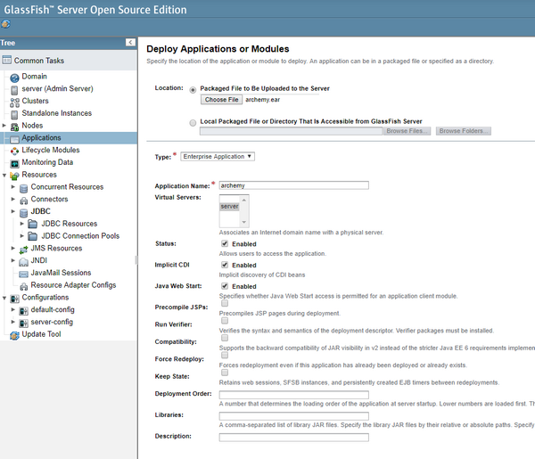

# Cloud Computing Homework 2

## 1. Building Archemy

1. Make sure you have Java JDK 1.7 installed
1. Install [JDeveloper](http://www.oracle.com/technetwork/developer-tools/jdev/overview/index.html) on your machine
    - Choose custom installation
    - Choose the Local JDK 1.7 instead of the bundled Sun SDK 1.6
1. Click on **Launch Oracle JDeveloper 11g** and then on **Default Role**

    

1. Click on **Open Application** in the left pane and choose the *Archemy.jws* file of the Archemy App folder provided.
1. Click on **Application** (top bar), **Deploy** and **Archemy_Project1_Archemy**

    

1. Select *Deploy to EAR* and click *Finish*

    

    You can ignore the Warnings from the Compiler. You should see `----  Deployment finished.  ----` at the end of the Deployment console in JDeveloper.

    The `.ear` file is now in the **deploy** directory of the Application directory

## 2. Installing

Docker is used to install the dependencies and the application.

The application *Archemy* relies on:

- Glassfish 5.0
- Fortress OpenLDAP (requires Java 8 to be built)
- ADF Essentials
- Java 7
- MySQL database

For now, only the MySQL database runs in a separate container. The rest is running in the same Docker container.
The latest should be broken into different containers at a later stage.

Docker Compose is used to build, configure and launch all the necessary containers.

### 2.1 Pre-requirements

Note that the following is already done and is for **reference only**.

The following file structure should be obtained at the end of this section:

```
database-init/
    |---a.archemy_schema.sql
    |---b.procedures.sql
glassfish-fortress/
    |---fortress/
        |---ldap/
            |---symas-openldap-silver.deb
        |---build.properties
        |---slapd.properties
    |---glassfish4/
        |---glassfish
            |---domains/
                |---domain1/
                    |---lib/
                        |---adf-essentials.zip
                        |---archemy-security-1.0-SNAPSHOT-jar-with-dependencies.jar
            |---lib/
                |---mysql-connector-java-5.1.40-bin.jar
    |---Dockerfile
    |---entrypoint.sh
docker-compose.yml
```

(Files not indicated such as *readme.md* are irrelevant)

#### Archemy SQL scripts

A SQL script is generated from the database model so that it can be used by the Docker container.

1. Install [MySQL and MySQL Workbench](https://www.mysql.com/products/workbench/)
1. In MySQL Workbench, open the *archemy_schema.mwb* file provided
1. Click on **File** (top bar), **Export as...** and **Forward Engineer SQL Create script...**

    

1. Click *Next*, *Next*, *Finish*
1. The resulting SQL file `a.archemy_schema.sql` is stored in `database-init/`
1. Also place the provided file `procedures.sql` in `database-init/` as `b.procedures.sql`

#### ADF Essentials

1. Download `adf-essentials.zip` from [Oracle](http://www.oracle.com/technetwork/developer-tools/adf/downloads/index.html)
1. Place it in `glassfish-fortress/glassfish4/glassfish/domains/domain1/lib/`

#### Symas OpenLDAP Silver

1. Download the [Ubuntu Symas OpenLDAP Silver](https://downloads.symas.com/builds/symas-openldap-directory-silver-edition-v2-4-45-4-ubuntu-linux-16-amd64/)
1. Place the **.deb** file in `glassfish-fortress/fortress/ldap/` as `symas-openldap-silver.deb`

#### Archemy Jar files

1. Place the provided `mysql-connector-java-5.1.40-bin.jar` in 
`glassfish-fortress/glassfish4/glassfish/lib/`
1. Place the provided `archemy-security-1.0-SNAPSHOT-jar-with-dependencies.jar` in 
`glassfish-fortress/glassfish4/glassfish/domains/domain1/lib/`

### 2.2. Docker Compose

1. With a terminal, go the directory in which the *docker-compose.yml* is located.
1. Build the image, download the database image (mariadb) and launch the containers with:

    ```bash
    docker-compose up -d
    ```

1. HTTP Interfaces
    - Glassfish admin console: [http://localhost:4848](http://localhost:4848)
        - The username is `admin` and the password is `password` (see `docker-compose.yml`)
    - Glasfish server: [http://localhost:8080](http://localhost:8080)
    - LDAP: [http://localhost:8389](http://localhost:8389)

## 3. Deploying Archemy

1. Log in with the Glassfish admin console at [http://localhost:4848](http://localhost:4848)

    

1. Create the MySQL Data source
    1. Go to Resources > JDBC > JDBC Connection Pools

        

    1. Click on **New...**
    1. Enter the following:
        - Pool Name: `ArchemyPool`
        - Resource type: `javax.sql.DataSource`
        - Database Driver Vendor: `MySql`
    1. Click on **Next** (Top right)
    1. Select and change the following in the Additional Properties at the bottom:
        - serverName: `archemy_database` (see `docker-compose.yml` database hostname)
        - user: `root`
        - password: `password` (see `docker-compose.yml` database environment variable)
        - databaseName: `archemy`
    1. Click on **Finish**
    1. Click on *ArchemyPool*, click on the **Advanced** tab, go to the Connection Validation section and change:
        - Connection Validation: `Required`
        - Validation method: `table`
        - Table Name: `DUAL`
    1. Click on **Save**
    1. Go to Resources > JDBC > JDBC Resouces on the left pane
    1. Click on **New** at the top
    1. Enter the following:
        - JNDI Name: `jdbc/MySQLDataSource`
        - Pool Name: `ArchemyPool`
    1. Click OK
1. On the left pane, go to **Applications**, click on **Deploy...** at the top
1. Choose the **archemy.ear** file from the container at `/archemy.ear`

    

1. Click OK