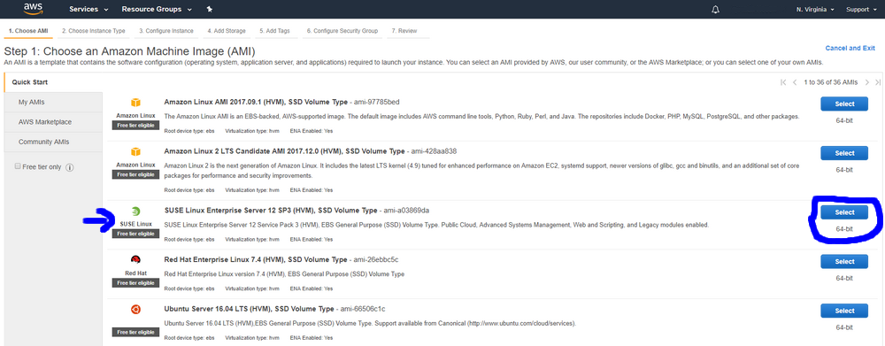
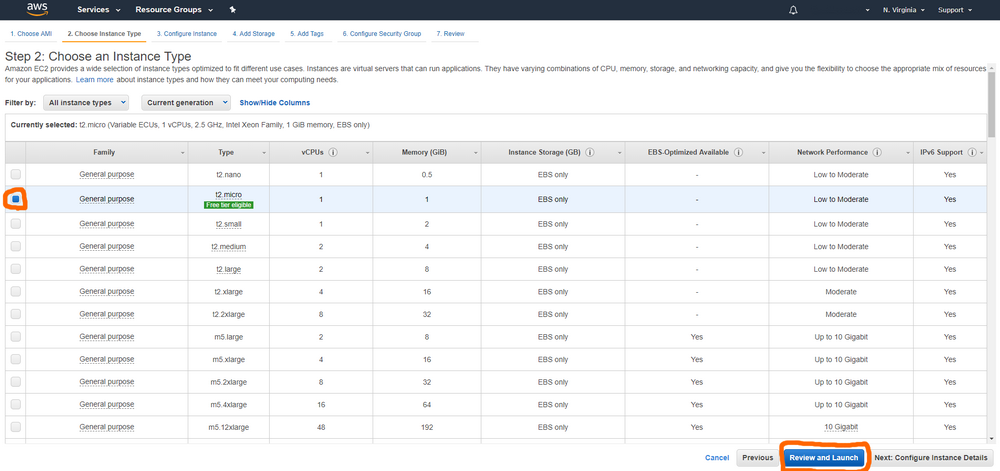

# Cloud computing: session 1

## AWS EC2

1. Log in to [Amazon AWS](https://console.aws.amazon.com/). You end up in their Home page:

    [](https://console.aws.amazon.com/)

2. Go to the [Amazon EC2 Launch Instance Wizard](https://console.aws.amazon.com/ec2/#LaunchInstanceWizard)
3. From the Quick Start tab, choose the `SUSE 64 bit Linux stack` **Amazon Machine Image** (*AMI*)

    [](https://console.aws.amazon.com/ec2/#LaunchInstanceWizard)
    
4. Choose the **micro** instance type and click on *Review and launch*

    [](https://console.aws.amazon.com/ec2/#LaunchInstanceWizard)

5. Launch the instance by clicking **Launch**

    [](https://console.aws.amazon.com/ec2/#LaunchInstanceWizard)
    
6. Choose **Create a new key** and keep the *.pem* private key file safe on your side.
7. Check your running instances [here](https://console.aws.amazon.com/ec2/?#Instances) and wait for the instance to be in the **running** state.

    [](https://console.aws.amazon.com/ec2/#Instances)

8. Make sure you have ssh installed on your machine
9. To connect to your instance, enter the following in a terminal:

    ```bash
    ssh -i "/path/where/your/PEMkeyfile/is/cloud.pem" ec2-user@xxx-00-000-000-00.compute-1.amazonaws.com
    ```

    Make sure to replace `xxx-00-000-000-00` with the public DNS IP of your instance.