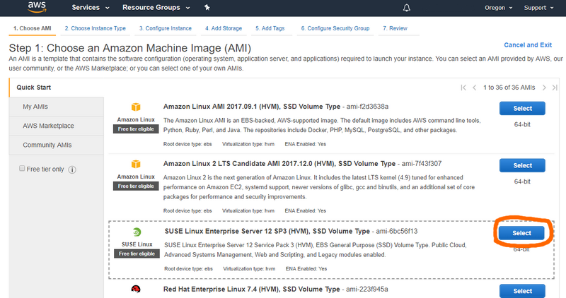
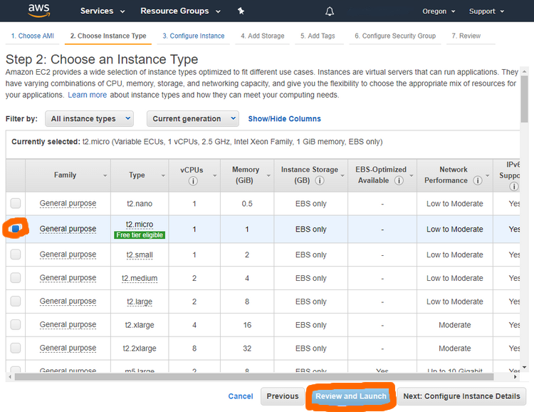

# Cloud computing: Assignment 1

## AWS SUSE 64 bit Linux instance

### Launching an instance

1. Log in (or sign up) on [https://console.aws.amazon.com](https://console.aws.amazon.com)
1. Go to the [Amazon EC2 Launch Instance Wizard](https://console.aws.amazon.com/ec2/#LaunchInstanceWizard)
1. From the Quick Start tab, choose the `SUSE Linux Enterprise Server 12 SP3 (HVM), SSD Volume Type` **Amazon Machine Image** (*AMI*)

    [](https://console.aws.amazon.com/ec2/#LaunchInstanceWizard)
    
1. Select **t2.micro** as the type and click on **Review and Launch**

    [](https://console.aws.amazon.com/ec2/#LaunchInstanceWizard)
    
1. Launch the instance by clicking **Launch** from the EC2 LaunchWizard

    [](https://console.aws.amazon.com/ec2/#LaunchInstanceWizard)

### Connecting to it

1. Choose **Create a new key** and create a key. Keep the downloaded PEM private key file.
1. Make sure you have **ssh** installed on your machine
1. Check your running instances at [https://console.aws.amazon.com/ec2/?#Instances](https://console.aws.amazon.com/ec2/?#Instances) and wait for the instance to be in the **running** state.

    [](https://console.aws.amazon.com/ec2/#Instances)

1. To connect to your instance, enter the following in a terminal:

    ```bash
    ssh -i "/path/where/your/key/is/bosh.pem" ec2-user@xxx-00-000-000-00.compute-1.amazonaws.com
    ```

    Make sure to replace `xxx-00-000-000-00` with the public DNS IP of your instance.

    
## AWS, Bosh and Cloud Foundry

### Domain

1. Register a domain somehow, say `example.com`
1. Go to the [Amazon Route 53 Hosted Zones](https://console.aws.amazon.com/route53/home?#hosted-zones:)
1. Click on *Create Hosted Zone* twice
1. On the right pane, fill in the following information:
    - Domain name: `example.com`
    - Type: `Public Hosted Zone`
1. From your domain registrar, delegate DNS authority for your hosted zone to your four Amazon Route 53 name servers. To do this, replace your registrar’s NS records for the domain with the NS record values you created in the last step.

### IAM bbl-policy

1. Create a new policy at [https://console.aws.amazon.com/iam/home?#/policies$new?step=edit](https://console.aws.amazon.com/iam/home?#/policies$new?step=edit)
1. Click on *JSON* then paste the following content in the text field. Finally click *Review policy*.

    ```json
    {
        "Version": "2012-10-17",
        "Statement": [
            {
                "Effect": "Allow",
                "Action": [
                    "ec2:*",
                    "cloudformation:*",
                    "elasticloadbalancing:*",
                    "iam:*",
                    "route53:*",
                    "logs:*",
                    "kms:*"
                ],
                "Resource": [
                    "*"
                ]
            }
        ]
    }
    ```

1. On the [Review page](https://console.aws.amazon.com/iam/home#/policies$new?step=review), enter the name `bbl-policy` and click on *Create policy*

### IAM bbl-user

1. Click on [this link](https://console.aws.amazon.com/iam/home?#/users$new?step=details&accessKey&userNames=bbl-user) to start creating a user `bbl-user` with programmatic access. Click on *Next: Permissions*
1. Click on *Attach existing policies*, search for `bbl-policy` and select it. Click on *Next: Review*
1. Click on *Create user*
1. Note the **Access key ID** and the **Secret access key** (click on *Show*)

### Development VM

1. Make sure you have [Docker](https://www.docker.com/community-edition) installed on your machine to run the virtual machine.
1. With a terminal, go to the directory where the [Dockerfile](Dockerfile) is located and enter:

    ```bash
    sudo docker build -t boshaws ./
    sudo docker run -it --rm boshaws
    ```
    
This virtual machine contains the following tools:
- Terraform
- Bosh CLI 2
- Bosh Bootloader for Cloud Foundry
- Cloud Foundry CLI
- All necessary compilation tools (gcc, ruby, etc.)

### Bosh infrastructure

1. In the Docker VM, create the infrastructure and deploy a Bosh Director with the following commands. 
    In all the next commands, replace YOUR-ACCESS-KEY-ID, YOUR-SECRET-ACCESS-KEY and YOUR-AWS-REGION.

    ```bash
    bbl plan --iaas aws --aws-access-key-id YOUR-ACCESS-KEY-ID --aws-secret-access-key YOUR-SECRET-ACCESS-KEY --aws-region YOUR-AWS-REGION
    bbl up --aws-access-key-id YOUR-ACCESS-KEY-ID --aws-secret-access-key YOUR-SECRET-ACCESS-KEY
    ```
    
1. Export environment variables generated with:

    ```bash
    eval "$(bbl print-env)"
    ```
   
You can delete the Bosh Director infrastructure with:

```bash
bbl destroy --aws-access-key-id YOUR-ACCESS-KEY-ID --aws-secret-access-key YOUR-SECRET-ACCESS-KEY
```

### Cloud Foundry

1. Clone the repository with:

    ```bash
    git clone https://github.com/cloudfoundry/cf-deployment.git && cd cf-deployment
    ```

1. Check you can log in to your BOSH Director with:

    ```bash
    bosh log-in
    ```
    
1. Check the last line of *cf-deployment.yml*:

    ```bash
    tail -1 cf-deployment.yml
    ```
    
    Note the version number, say it is `3541.2`.
    
1. Upload the corresponding stemcell with (make sure it's the same version !):

    ```bash
    bosh upload-stemcell https://bosh.io/d/stemcells/bosh-aws-xen-hvm-ubuntu-trusty-go_agent?v=3541.2
    ```
    
1. Deploy with:

    ```bash
    bosh -d cf deploy cf-deployment/cf-deployment.yml
    ```

