# Cloud computing: session 1

## AWS EC2 Micro instance and bosh.yml

Log in to [Amazon AWS](https://console.aws.amazon.com/). You end up in their Home page:

[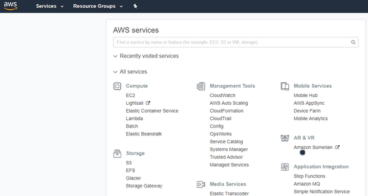](https://console.aws.amazon.com/)

  
### Key Pair

1. Go to the [EC2 Key Pair menu](https://console.aws.amazon.com/ec2#KeyPairs) and click on *Create Key Pair*

    [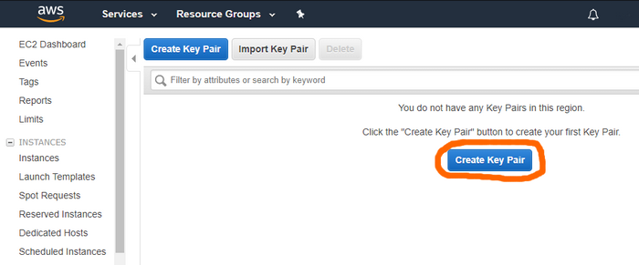](https://console.aws.amazon.com/ec2#KeyPairs)

1. Name the key `bosh` and click on *Create*

    [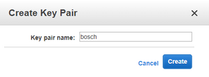](https://console.aws.amazon.com/ec2#KeyPairs)
    
1. Store the private key file **bosch.pem** securely on your computer

### EC2 Launch Instance Wizard
  
1. Go to the [Amazon EC2 Launch Instance Wizard](https://console.aws.amazon.com/ec2/#LaunchInstanceWizard)
1. From the Quick Start tab, choose the `SUSE 64 bit Linux stack` **Amazon Machine Image** (*AMI*)

    [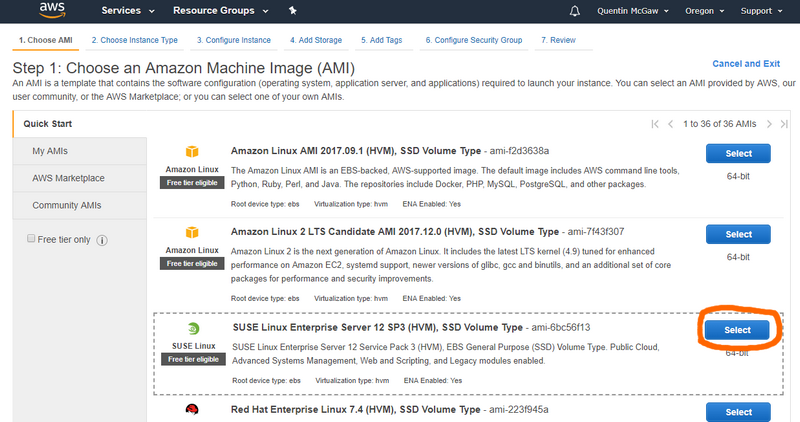](https://console.aws.amazon.com/ec2/#LaunchInstanceWizard)
    
1. Choose the **micro** instance type and click on *Next: Configure Instance Details*

    [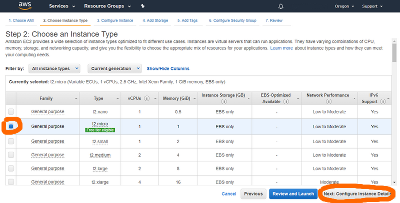](https://console.aws.amazon.com/ec2/#LaunchInstanceWizard)

### VPC

1. Click on *Create new VPC* to go to the VPC Dashboard

    [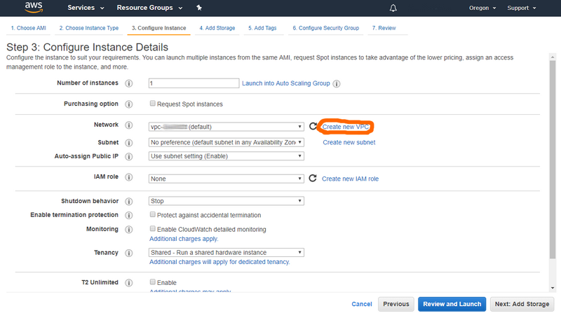](https://console.aws.amazon.com/ec2/#LaunchInstanceWizard)

1. Click on *Create VPC*

    [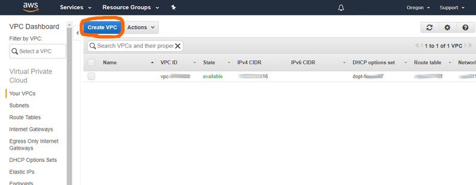](https://console.aws.amazon.com/vpc/#vpcs)

1. Fill the information with:
    - Name tag: `bosh`
    - IPv4 CIDR block: `10.0.0.0/16`
    - Hardware tenancy: `Default`
    
    Click on *Yes, Create*  

    [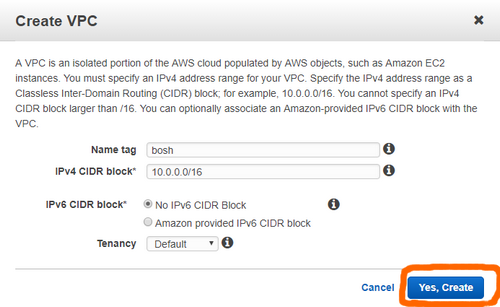](https://console.aws.amazon.com/vpc/#vpcs)

### Subnet

1. Click on *Subnets* on the left pane then on *Create Subnet*

    [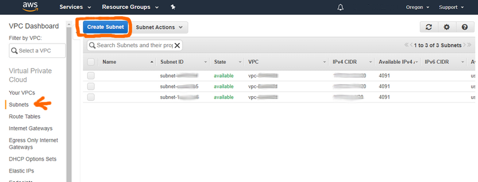](https://console.aws.amazon.com/vpc/#subnets)

1. Fill the information with:
    - Name tag: `public`
    - VPC: `vpc-????????? | bosh`
    - Availability Zone: `us-west-2a`
    - IPv4 CIDR block: `10.0.0.0/24`
    
    Click on *Yes, Create*  

    [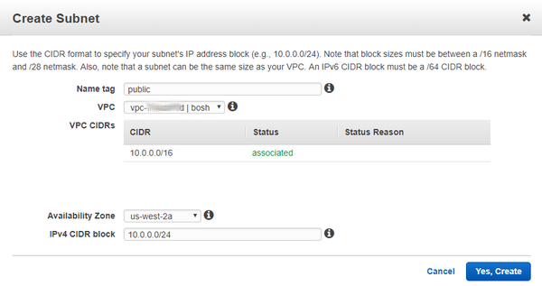](https://console.aws.amazon.com/vpc/#subnets)

1. Edit the [**bosh.yml**](bosh.yml) of this repository by:
    - Replacing `REGION` with `us-west-2` in this case
    - Replacing `AVAILABILITY-ZONE` with `us-west-2a` in this case
    - Replacing `SUBNET-ID` with the subnet ID of your *public* subnet (let it be `402bd139`)

    [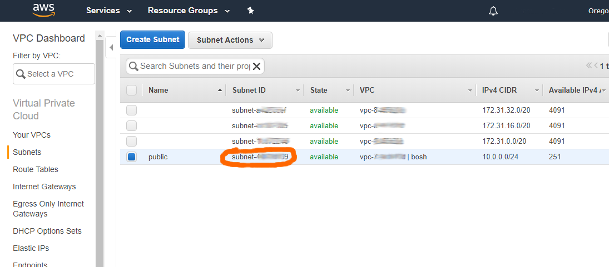](https://console.aws.amazon.com/vpc/#subnets)
    
### Elastic IP
    
1. Click on *Elastic IPs* in the left pane and click on *Allocate New Address*

    [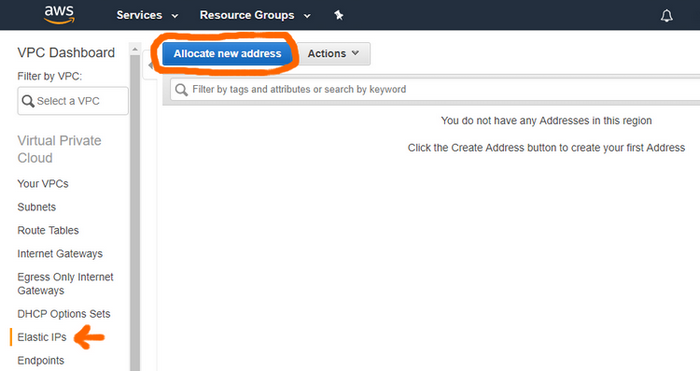](https://console.aws.amazon.com/vpc/#Addresses)

1. Click on *Allocate*

    [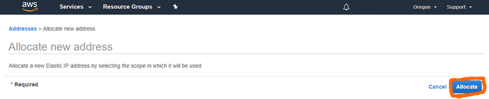](https://console.aws.amazon.com/vpc/#Addresses)

1. Note the allocated Elastic IP (say `35.161.118.219`) and edit the [**bosh.yml**](bosh.yml) by:
    - Replacing `ELASTIC-IP` with `35.161.118.219` in this case

    [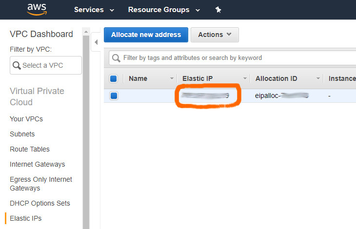](https://console.aws.amazon.com/vpc/#Addresses)

### Security Group

1. Click on *Security Groups* in the left pane and click on *Create Security Group*

    [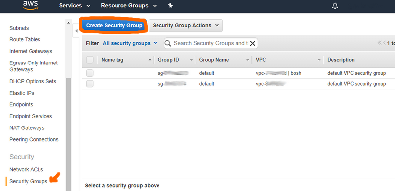](https://console.aws.amazon.com/vpc/#securityGroups)

1. Fill the information with:
    - Name tag: `bosh`
    - Group name: `bosh`
    - Description: `BOSH deployed VMs`
    - VPC: `vpc-????????? | bosh`
    
    Click on *Yes, Create*  

    [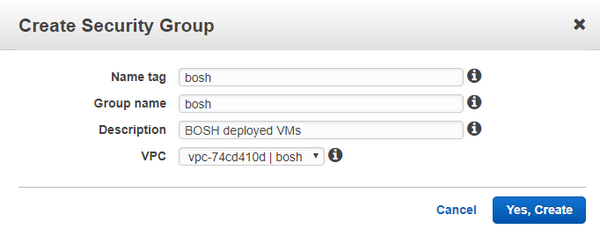](https://console.aws.amazon.com/vpc/#securityGroups)

1. Select the `bosh` security group, click on *Inboud Rules* and click *Edit*

    [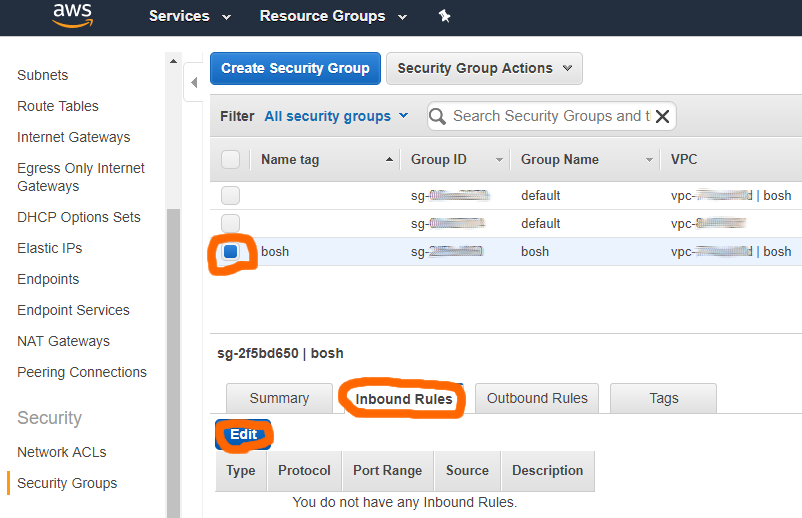](https://console.aws.amazon.com/vpc/#securityGroups)

1. Find your public IP address at [http://ipecho.net/plain](http://ipecho.net/plain)
    
1. Add the following rules in AWS:

    | Type        | Protocol           | Port Range  | Source | Description |
    | --- | --- | --- | --- | --- |
    | Custom TCP Rule | TCP (6) | 22 | *????* | SSH access from bosh-init |
    | Custom TCP Rule | TCP (6) | 6868 | *????* | BOSH Agent access from bosh-init |
    | Custom TCP Rule | TCP (6) | 25555 | *????* | BOSH Director access from CLI |
    | All TCP | TCP (6) | ALL | *sg-???????? \| bosh* | Management and data access |
    | All UDP | UDP (17) | ALL | *sg-???????? \| bosh* | Management and data access |


### Launch and connect to the instance

1. Make sure you have **ssh** installed on your machine
1. Launch the instance by clicking **Launch** from the EC2 LaunchWizard

    [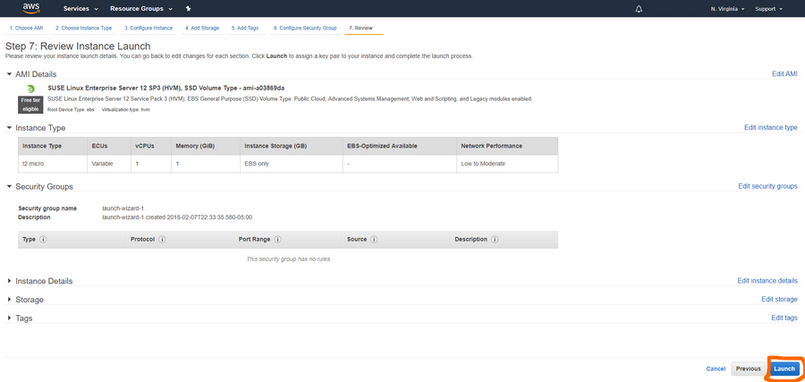](https://console.aws.amazon.com/ec2/#LaunchInstanceWizard)
    
1. Choose **Use an existing key** and choose the `bosh` key.
1. Check your running instances [here](https://console.aws.amazon.com/ec2/?#Instances) and wait for the instance to be in the **running** state.

    [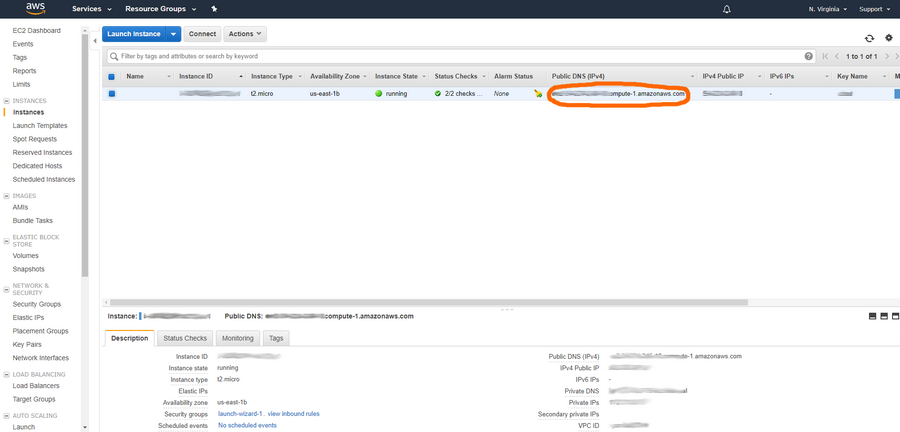](https://console.aws.amazon.com/ec2/#Instances)


1. To connect to your instance, enter the following in a terminal:

    ```bash
    ssh -i "/path/where/your/key/is/bosh.pem" ec2-user@xxx-00-000-000-00.compute-1.amazonaws.com
    ```

    Make sure to replace `xxx-00-000-000-00` with the public DNS IP of your instance.