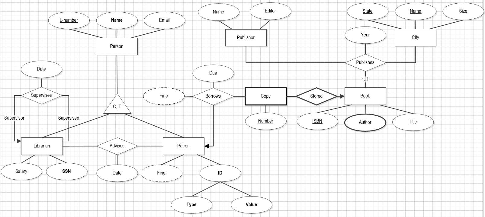
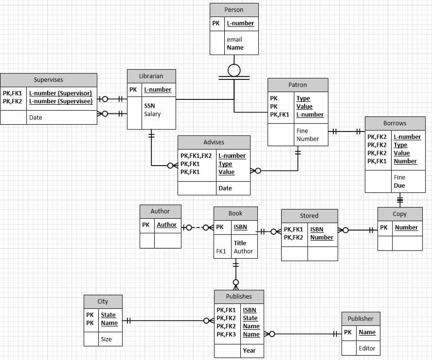
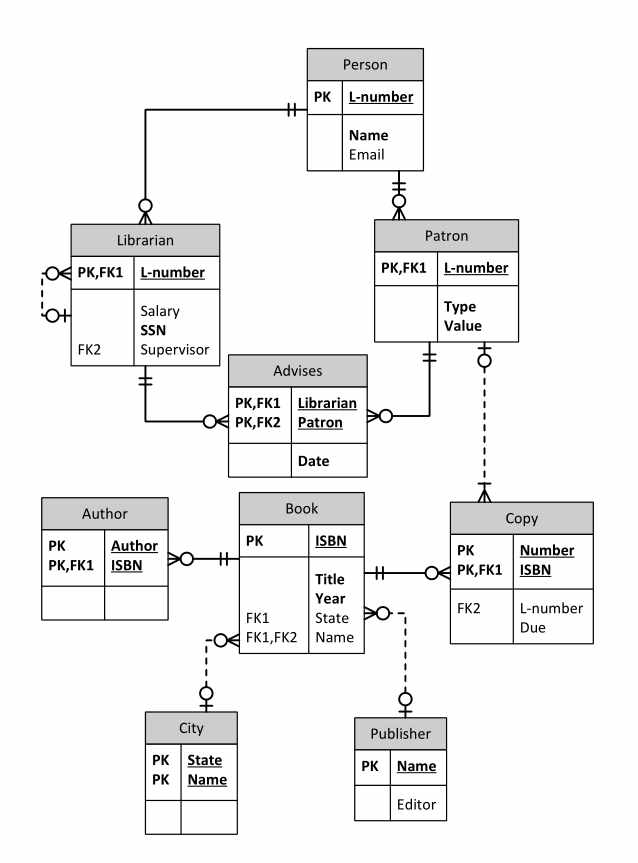

# Database Systems

## Assignment 1
Design of an ER diagram according to provided specifications, using Visio 2010.

The resulting *VSD* file is [Assignment_1_ERDiagram.vsd](Assignment_1_ERDiagram.vsd)

It looks like the following:



## Assignment 2
Design of a relational database diagram using Crow's feet notation from
a provided ER diagram (similar to assignment 1).

The resulting *VSD* file is [Assignment_2.vsd](Assignment_2.vsd)

It looks like the following:



## Assignment 3
Design of a SQL script to query a database on Oracle.

The database implemented follows the following diagram:



The resulting *SQL* file is [Assignment_3.sql](Assignment_3.sql)

It looks like the following:

```sql
/* ... */

CREATE TABLE ANSWER01 AS
    SELECT DISTINCT p.LNUMBER AS PERSON_LNUMBER, p.NAME AS PERSON_NAME
    FROM PERSON p, LIBRARIAN l, PATRON q
    WHERE p.LNUMBER = l.LNUMBER and l.LNUMBER = q.LNUMBER
    ORDER BY p.LNUMBER ASC;
    
/* ... */
```

## Assignment 4
Design of another SQL script to query a database on Oracle.

The database implemented follows the following diagram:


The resulting *SQL* file is [Assignment_4.sql](Assignment_4.sql)

It looks like the following:

```sql
/* ... */

CREATE TABLE ANSWER01 AS
SELECT DISTINCT NAME AS PERSON_NAME
FROM PERSON, TEMP2
WHERE PERSON.LNUMBER = TEMP2.LNUMBER
ORDER BY PERSON_NAME ASC;
    
/* ... */
```

## Assignment 5
Design of a SQL script to create a database on Oracle and create views & triggers.

The resulting *SQL* file is [Assignment_5.sql](Assignment_5.sql)

It looks like the following:

```sql
/* ... */

UPDATE A
SET age = age + 1;

UPDATE W
SET weight = CASE ID 
    WHEN 1 THEN 160
    WHEN 3 THEN 140
    WHEN 4 THEN 155
    WHEN 6 THEN 160
    WHEN 7 THEN 175
    WHEN 8 THEN 130
    WHEN 9 THEN 160
    WHEN 10 THEN 180
    ELSE weight
    END;
    
/* ... */
```