# Paul Graham: How to start a startup

## I - A Vision of Startup Culture
### Readings
- **Peter Thiel** on Startups, April 2012, Blake Masters

[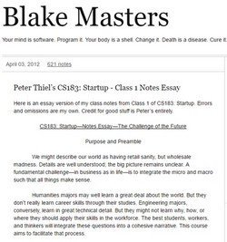](http://blakemasters.com/post/20400301508/cs183class1)

- **From Zero to One**, *Peter Thiel*

[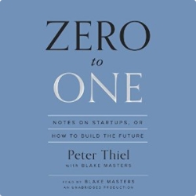](https://www.amazon.com/Zero-One-Notes-Startups-Future-ebook/dp/B00J6YBOFQ)

- **How to start a startup**, *Paul Graham*

[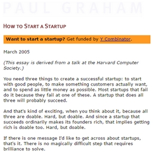](http://www.paulgraham.com/start.html)

### Summary
- How to start a startup, Paul Graham
   1. Start with good people
       - You want *animals*, passionate and addicted about their job
       - Three qualities:
           - Smart
           - Get things done
           - Bearable personality
       - Get them from a network of friends is great
       - Only business people as founders is bad as they don't know limitations and possibilities
       - Get **1** business person to focus on what customers want, although tech can do it as well.
   2. Make something customers actually want
       - Look at something people are trying to do
       - Figure out how to do it in a way that does not suck
       - The idea is worth nothing without its people
       - Make an MVP ASAP
   3. Spend as little money as possible

   
   
## II - NAE Grand Challenges
### Readings
- **NAE Grand Technical Challenges for the Century**

Also available [here](http://www.northeastern.edu/academic-plan/wp-content/uploads/2015/10/NAE-Grand-Challenges-2008.pdf)

### Summary
- What I learnt
- How it affected me

## III - The Early Internet Bubble: the Inktomi story
### Videos
- **Inktomi's Wild Ride** - *A Personal View of the Internet Bubble*, E. Brewer, Talk at Computer History Museum, 2004

[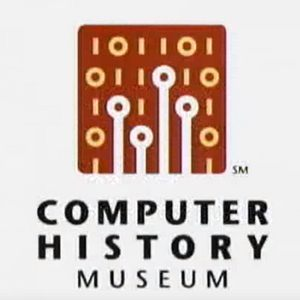](https://www.youtube.com/watch?v=E91oEn1bnXM)

### Summary
- What I learnt
- How it affected me

## IV - Wearable Computing Vision
### Readings
- *The Challenges of Wearable Computing*, Thad Starner

[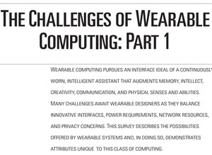](http://www.cc.gatech.edu/~thad/p/magazine/published-part1.pdf)

[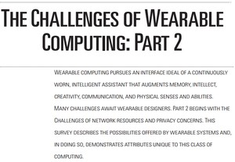](http://www.cc.gatech.edu/~thad/p/magazine/published-part2.pdf)

### Summary
- What I learnt
- How it affected me

## V - Wearables and Healthcare: Fitbit and Google
### Videos
- James Park (**Fitbit**) and Jeff Clavier (**SoftTech VC**) at *Startup Grind 2014*

[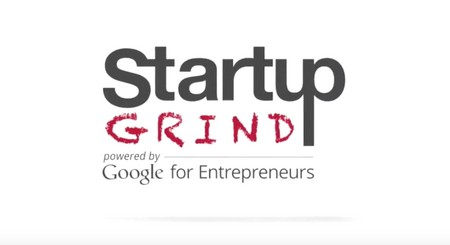](https://www.youtube.com/watch?v=saVicnu0l0k)

- **Google** *Diabetes Contact Lenses*

[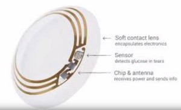](https://www.youtube.com/watch?v=DxB6Lg-AOpg)

### Summary
- What I learnt
- How it affected me

## VI - Personalized Diagnostics and Medicine: 23andme and Watson
### Readings
- **23andme** white paper *Estimating Complex Phenotype	Prevalence Using Predictive Models*

[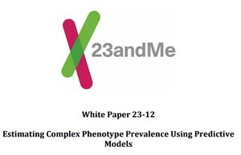](https://api.23andme.com/res/pdf/23-12_predictivemodel_methodology_02oct2015.pdf)

- **23andme** white paper *Estimating Carrier Frequency, Carrier Detection Rate, and Post-Test Carrier Risk for Recessive Disorders*

### Videos
- **23andMe** *Empowering Consumer-Enabled Research* at Berkeley University of California

[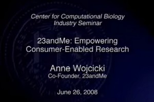](https://www.youtube.com/watch?v=Q6KUf75bBEQ)

- **IBM** *Watson* for Healthcare

[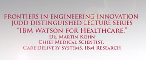](https://www.youtube.com/watch?v=UFF9bI6e29U)

### Summary
- What I learnt
- How it affected me

## VII - Personalized learning: Knewton
### Readings
- **Knewton** adaptive learning *white paper*

[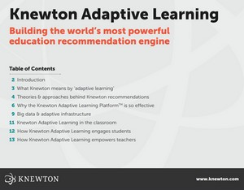](https://www.knewton.com/wp-content/uploads/knewton-adaptive-learning-whitepaper.pdf)

### Videos
- **Knewton** Adaptive Learning and its role in Learning and Online Education featuring *Jose Ferreira*

[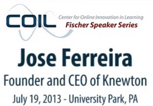](https://www.youtube.com/watch?v=4uNHR0uo5Y4)

### Summary
- What I learnt
  - Continuous data mining for students
  - Social media data sold to insurance companies
  - Internet = Distribution + Data mining (personalization)
  - Different meanings of adaptive learning
- How it affected me
  - Data mining for food preferences
  
## VIII - Green computing and alternative energy
### Readings
- **NAE grand challenges for engineers** *Make Solar economical*

[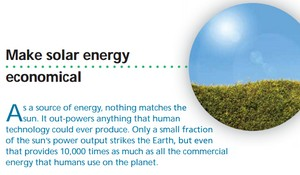](https://www.youtube.com/watch?v=4uNHR0uo5Y4)

### Videos
- *Bill Weihl*’s role at **Google**

[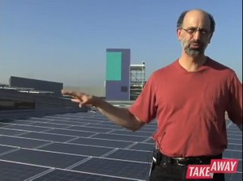](https://www.youtube.com/watch?v=92PZWXfQXWU)

- *Green DataCenters - Power and Cooling in the Modern World*

- Solar energy storage

### Summary
- What I learnt
- How it affected me